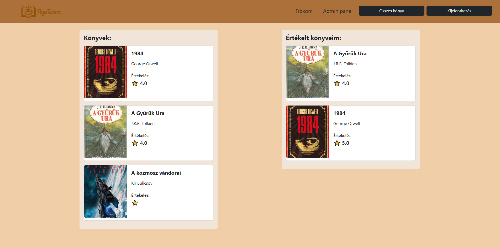
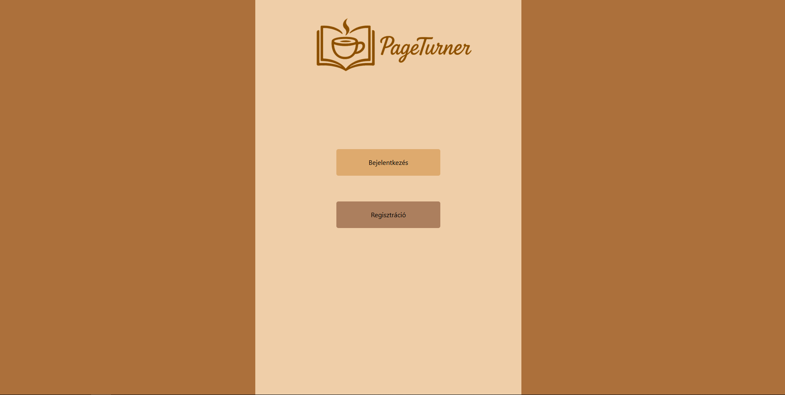
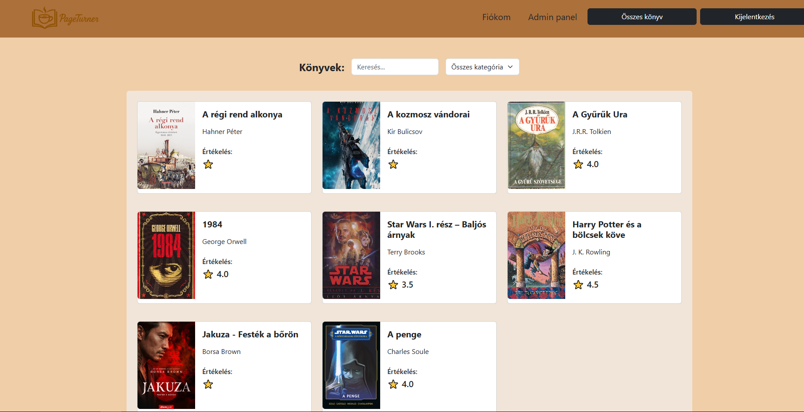
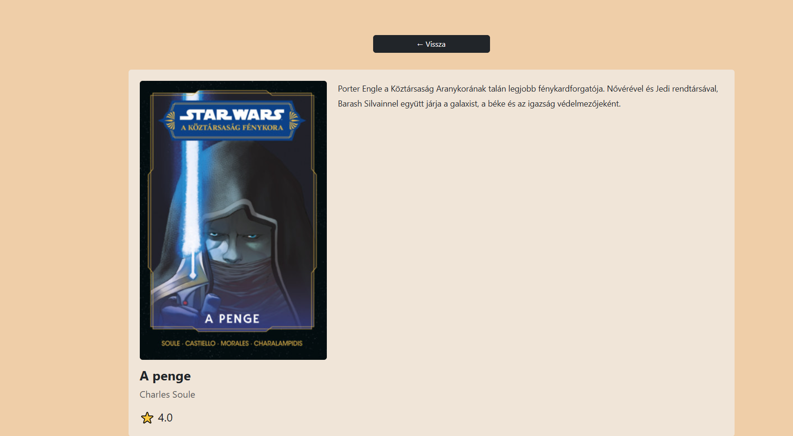
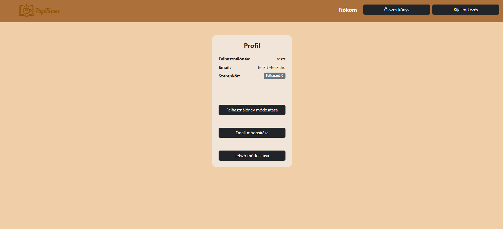
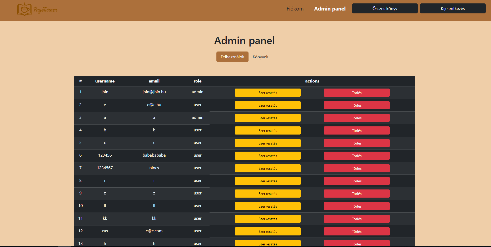

# 📚 PageTurner - Frontend


## 📋 Tartalomjegyzék

- [A projektről](#-a-projektről)
- [Főbb funkciók](#-főbb-funkciók)
- [Technológiai stack](#-technológiai-stack)
- [Projekt struktúra](#-projekt-struktúra)
- [Telepítés és futtatás](#-telepítés-és-futtatás)
- [Oldalak](#-oldalak)
- [Komponensek](#-komponensek)
- [API hívások](#-api-hívások)
- [Reszponzivitás](#-reszponzivitás)

---

## 🎯 A projektről



A PageTurner egy könyvajánló webalkalmazás frontendja. Az alkalmazás lehetővé teszi a felhasználóknak, hogy könyveket böngésszenek, értékeljenek, keressenek, és kezeljék saját profiljukat.

👉 [Backend repo](https://github.com/bogzbogz/pageturner.git)
👉 [Figma terv megtekintése](https://www.figma.com/design/l8HCMqhnD0AVO6jxKlsFKq/Untitled?node-id=0-1&p=f&t=l2PVsy2Zp7nOzW7F-0)


## ✨ Főbb funkciók

- 🔐 **Felhasználói hitelesítés** - Bejelentkezés és regisztráció


- 📖 **Könyvböngészés** - Könyvek listázása, keresése, kategória szerinti szűrés


- 📄 **Könyv részletek** - Részletes könyvoldalak leírással és értékeléssel


- 👤 **Profil kezelés** - Felhasználónév, email és jelszó módosítása


- 🛡️ **Admin panel** - Felhasználók és könyvek adminisztrálása pill navigációval


- 📱 **Reszponzív dizájn** - Hamburger menü, Bootstrap grid rendszer


---

## 🛠️ Technológiai stack

| Technológia | Leírás |
|-------------|--------|
| React 18 | UI framework |
| React Router v6 | Oldalak közötti navigáció |
| Bootstrap 5 | CSS framework, reszponzivitás |
| Vite | Build tool |
| Context API | Globális state kezelés (AuthContext) |

---

## 📂 Projekt struktúra

```
pageturner-frontend/
├── src/
│   ├── assets/
│   │   └── logo.png              # Alkalmazás logó
│   ├── components/
│   │   ├── NavBar.jsx            # Navigációs sáv
│   │   ├── Card.jsx              # Könyv kártya
│   │   ├── Table.jsx             # Felhasználó táblázat
│   │   ├── BookTable.jsx         # Könyv táblázat
│   │   ├── Gomb.jsx              # Újrafelhasználható gomb
│   │   └── InputMezo.jsx         # Újrafelhasználható input
│   ├── context/
│   │   └── AuthContext.jsx       # Globális auth state
│   ├── css/
│   │   ├── App.css               # Landing oldal stílusok
│   │   ├── Login.css             # Login oldal stílusok
│   │   └── Register.css         # Register oldal stílusok
│   ├── pages/
│   │   ├── App.jsx               # Landing oldal
│   │   ├── Login.jsx             # Bejelentkezés
│   │   ├── Register.jsx          # Regisztráció
│   │   ├── Home.jsx              # Főoldal
│   │   ├── Book.jsx              # Összes könyv oldal
│   │   ├── BookDetail.jsx        # Könyv részletek
│   │   ├── Profile.jsx           # Profil oldal
│   │   └── Admin.jsx             # Admin panel
│   ├── api.js                    # Backend API hívások
│   └── main.jsx                  # Belépési pont, routing
├── index.html
├── package.json
└── vite.config.js
```

---

## 🚀 Telepítés és futtatás

```bash
# Repo klónozása
git clone https://github.com/Vandush230517/PageTurner_Frontend.git

# Mappába lépés
cd PageTurner_Frontend

# Függőségek telepítése
npm install

# Fejlesztői szerver indítása
npm run dev
```

> ⚠️ A frontend futtatásához a backend szervernek is futnia kell!

---

## 📄 Oldalak

| Oldal | Útvonal | Leírás | Védett |
|-------|---------|--------|--------|
| Landing | `/` | Bejelentkezés/Regisztráció gombok | ❌ |
| Bejelentkezés | `/login` | Login form | ❌ |
| Regisztráció | `/register` | Regisztrációs form | ❌ |
| Főoldal | `/home` | Véletlenszerű és értékelt könyvek | ✅ |
| Könyvek | `/books` | Összes könyv, keresés, szűrés | ✅ |
| Könyv részlet | `/book/:id` | Könyv adatai és leírása | ✅ |
| Profil | `/profile` | Felhasználói adatok és módosítás | ✅ |
| Admin | `/admin` | Felhasználó és könyv kezelés | ✅ Admin |

---

## 🧩 Komponensek

### `NavBar.jsx`
- Hamburger menü mobilon (`navbar-expand-lg`)
- Aktív oldal kiemelése (`useLocation` hook)
- Admin panel link csak adminoknak

### `Card.jsx`
- Könyv megjelenítése (kép, cím, szerző, értékelés)
- Kattintásra navigál a könyv részlet oldalra

### `Table.jsx` / `BookTable.jsx`
- Bootstrap táblázat felhasználók/könyvek listázásához
- Szerkesztés és törlés gombok

### `Gomb.jsx`
- Újrafelhasználható gomb komponens
- `szin`, `onClick`, `text` propok

### `InputMezo.jsx`
- Újrafelhasználható input mező
- `label`, `type`, `value`, `setValue`, `placeholder` propok

---

## 🔗 API hívások

Az összes backend kommunikáció az `api.js` fájlban van centralizálva:

| Függvény | Metódus | Leírás |
|----------|---------|--------|
| `register` | POST | Regisztráció |
| `login` | POST | Bejelentkezés |
| `logout` | POST | Kijelentkezés |
| `whoAmI` | GET | Bejelentkezett user adatai |
| `getAllUsers` | GET | Összes felhasználó (admin) |
| `getAllBooks` | GET | Összes könyv (admin) |
| `deleteUser` | DELETE | Felhasználó törlése |
| `userEdit` | PUT | Felhasználó szerkesztése |
| `deleteBook` | DELETE | Könyv törlése |
| `bookEdit` | PUT | Könyv szerkesztése |
| `createBook` | POST | Könyv létrehozása |
| `getBooksByCategory` | GET | Kategória szerinti szűrés |
| `searchBooks` | GET | Könyv keresés |
| `editUsername` | PUT | Felhasználónév módosítás |
| `editEmail` | PUT | Email módosítás |
| `editPassword` | PUT | Jelszó módosítás |

---

## 📱 Reszponzivitás

Az alkalmazás reszponzív Bootstrap 5 és CSS media query-k kombinációjával:

- **Navbar** — `navbar-expand-lg`: nagy képernyőn vízszintes menü, mobilon hamburger gomb
- **Könyv grid** — `col-12 col-md-6 col-lg-4`: telefonon 1, tableten 2, asztali gépen 3 oszlop
- **Landing/Login/Register** — CSS grid `1fr 1fr 1fr`, mobilon `@media (max-width: 768px)` a barna sávok eltűnnek
- **Admin panel** — Bootstrap táblázat automatikusan alkalmazkodik

## 🚀 Jövőbeli tervek (Frontend)

- 💬 **Komment rendszer UI implementálása**
  - Könyvekhez kommentek megjelenítése és hozzáadása
  - Kommentek törlése és szerkesztése felhasználói jogosultsággal

- ❤️ **Kedvencek kezelése**
  - Könyvek mentése kedvencek közé
  - Külön „Kedvencek” oldal létrehozása (`/favorites`)

- ⭐ **Értékelési rendszer fejlesztése**
  - Csillagos értékelés vizuális megjelenítése
  - Felhasználói értékelések szerkesztése és törlése UI-ból

- 📊 **Felhasználói statisztikák**
  - Elolvasott és értékelt könyvek megjelenítése a profil oldalon
  - Egyszerű dashboard jellegű nézet kialakítása

---
